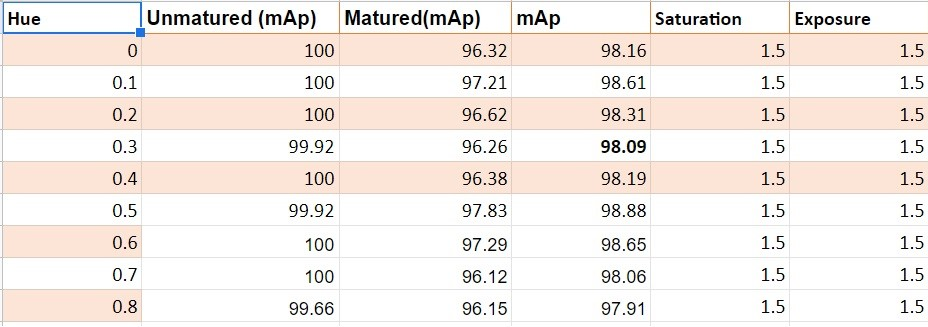
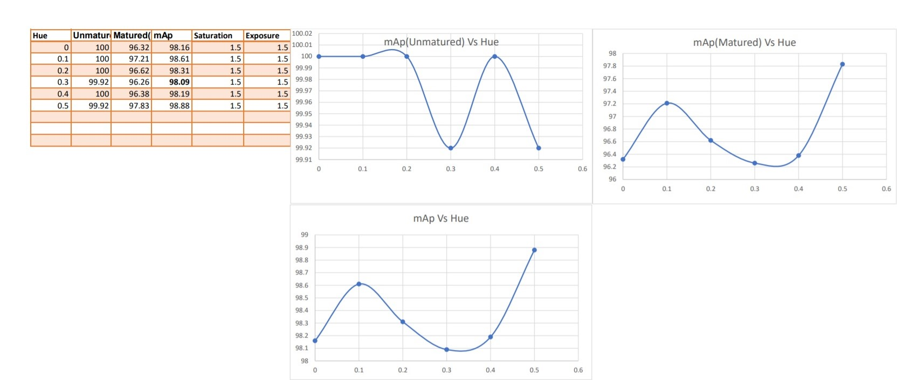

# YOLOv4_DarkNet

 - This is a project that I am working on, at NCRAI in collaboration with Kerala Agricultural University.

 - You can download the **YOLO V4 paper** [here](https://arxiv.org/pdf/2004.10934)
 
## Aim

Detect and classify two classes of Pineapples

 1. MATURED PINEAPPLE
 2. UNMATURED PINEAPPLE

## Index

 - The **yolov4_custom_object_detection.ipynb** is the code to train yolov4 using darknet
 - The folder **yolov4_test** contains the following data **:**
1. obg.zip (annotated training image data)
2. test.zip (annotated testing image data)
3. generate_train.py (python code to generate train.txt file)
4. generate_test.py (python code to generate test.txt file)
5. obj.names (names of the classe(s) )
6. obj.data (contains informations like class, location of train.txt&test.txt)
7. yolov4-obj.cfg (contains various arguments like convolutional layers, filters, max_batch,various augmentation parameters...)

## Dataset

The Dataset for this project is collected and annotated by ourselves.
## Our Research
 
 Inorder to improve our  detection and classification of the classes we have performed some experiments on color augmentation parameters of YOLO V4 .
 We have adjusted the color augmentation parameters **HUE**, **SATURATION** and **EXPOSURE** and trained the YOLO V4 and analyzed the results
 
 Checkout this to know  moreabout the color augmentation parameters that we have experimented : [**color augmentation **](https://www.ccoderun.ca/darkmark/DataAugmentationColour.html)
 
 
 
 
